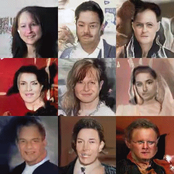
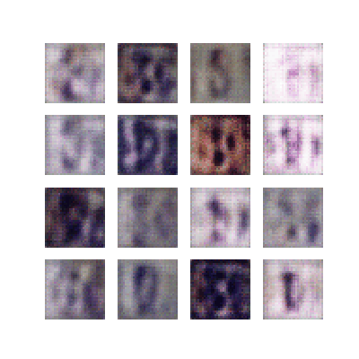

# 5242Project

Final Project for 5242 Advanced Machine Learning  

## Members

Chirong Zhang cz2533

Zhichao Liu zl2686

Yunxiao Zhao yz3380

Yusang Mao ym2694

## Tasks

Implement Inception score

Try different architectures

Try GAN on SVHN data

Implement different kinds of GAN  

DCGAN  
FCCGAN  
WGAN   
- clip wgan-clip  
- gradient penalty wgan-gp  

Spectrual Normalization   

## Results

SVHN  

MNIST  

## reference

[Inception Score](https://arxiv.org/abs/1606.03498)  

[FCCGAN](https://arxiv.org/abs/1905.02417)  

[WGAN](https://arxiv.org/abs/1701.07875)

[WGAN-gp](https://arxiv.org/abs/1704.00028)

[Spectral Normalization](https://arxiv.org/abs/1802.05957)

## Acknowledge
