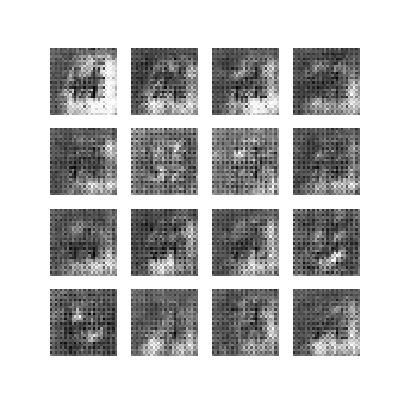

# 5242Project

Final Project for GR 5242 Advanced Machine Learning  

This is the GitHub for the complete project results.

The majority of work is done on the Google Cloud Platform by running scripts on Nvidia Tesla P100 GPU due to the limitation of notebooks.

## Dependency

Tensorflow 2.0

## Members

Chirong Zhang, cz2533  
Yunxiao Zhao, yz3380    
Zhichao Liu, zl2686  
Yusang Mao, ym2694  

## Tasks

1. Implement the Inception Score

2. Try GANs on MNIST data

3. Try GANs on SVHN data

4. Implement different architecture of GANs  

   - DCGAN  
   - FCCGAN  
   - WGAN   
     - Clip, WGAN-CLIP  
     - Gradient penalty, WGAN-GP  

   - Spectrual Normalization   

## Results

     

## To Run

To run a certain model  
Modify the global variables in config.py then
```
python main.py 
```

## Reference

[Inception Score](https://arxiv.org/abs/1606.03498)  

[FCCGAN](https://arxiv.org/abs/1905.02417)  

[WGAN](https://arxiv.org/abs/1701.07875)

[WGAN-GP](https://arxiv.org/abs/1704.00028)

[Spectral Normalization](https://arxiv.org/abs/1802.05957)

## Acknowledge

The main training process code is modified from [DCGAN tensorflow tutorial](https://www.tensorflow.org/tutorials/generative/dcgan).
